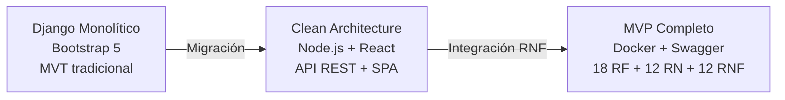
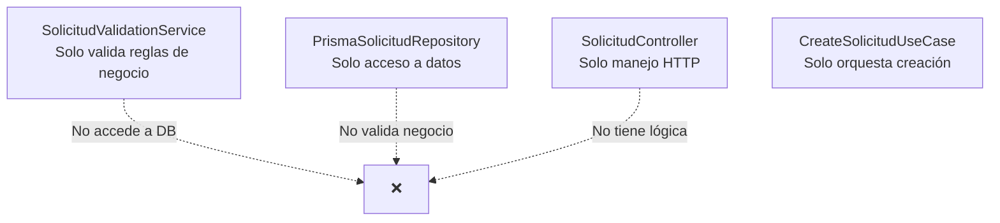
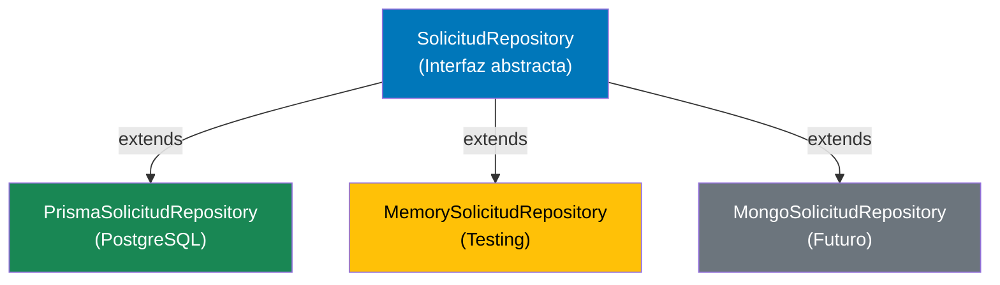
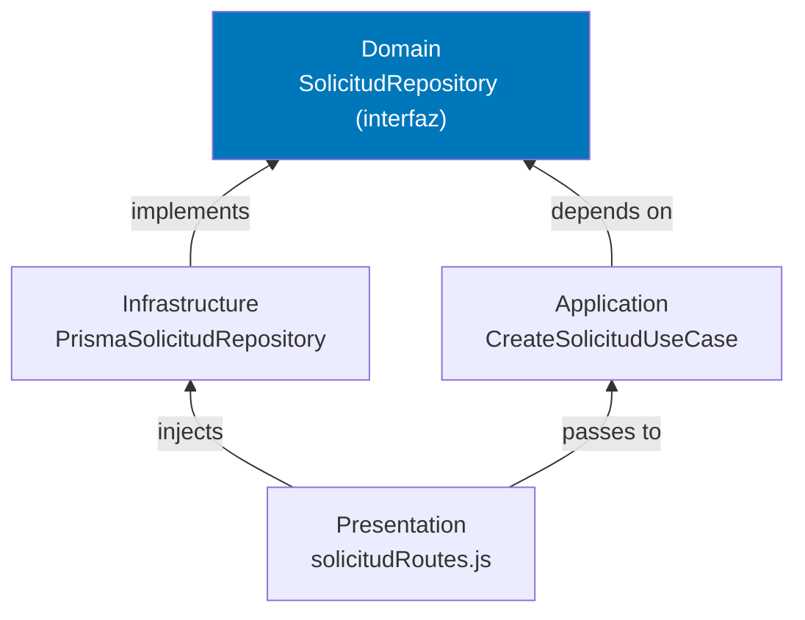
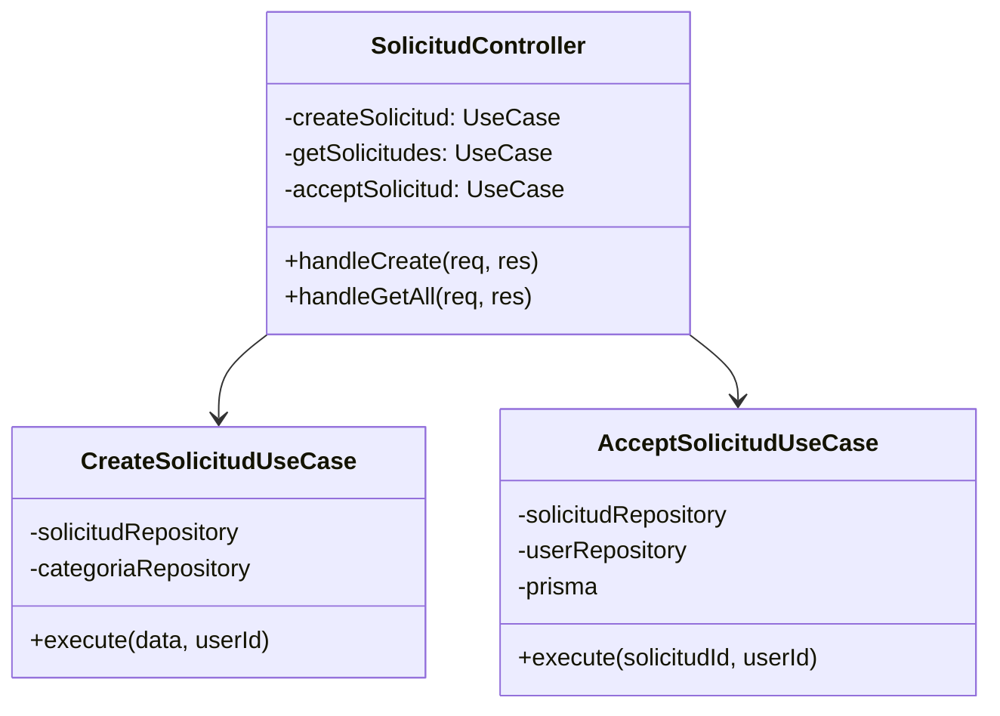
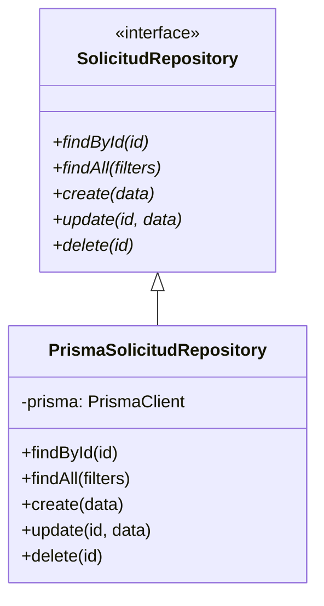
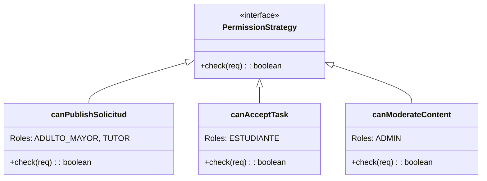
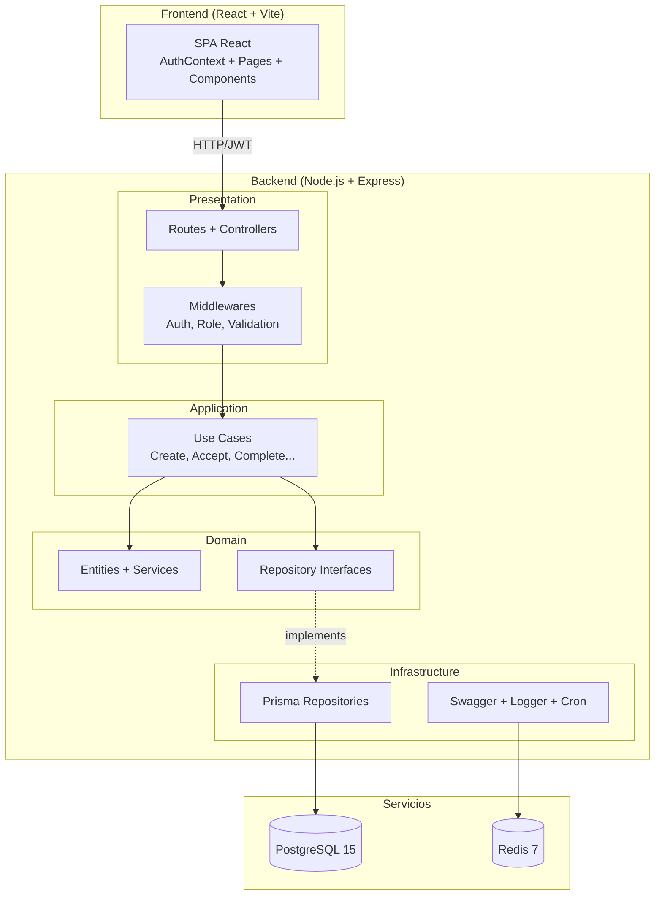

# Informe del Proyecto — UCT-Vínculo Mayor (AllyUCT)

---

## 1. Información General

| Campo | Detalle |
|---|---|
| **Proyecto** | UCT-Vínculo Mayor (AllyUCT) |
| **Asignatura** | Diseño de Software |
| **Docente** | Luciano Revillod |
| **Docente** | Guido Octavio Mellado Bravo |
| **Universidad** | Universidad Católica de Temuco |
| **Fecha** | 15 de Mayo de 2026 |

### Integrantes

| Integrante | Responsabilidad |
|---|---|
| Benjamin Sebastian | Requerimientos Funcionales (RF) + Frontend React |
| Francisco Valderrama | Requerimientos No Funcionales: Seguridad (RNF-SEG) |
| Sebastian Rivera | Requerimientos No Funcionales: Despliegue (RNF-DIS/REN) |
| Axel Gonzalez | Requerimientos No Funcionales: API/Arquitectura (RNF-MAN) |

---

## 2. Problema Abordado

En Temuco, una parte significativa de adultos mayores enfrenta barreras físicas y tecnológicas para realizar tareas diarias. Paralelamente, la comunidad estudiantil de la UCT busca espacios de vinculación social.

**UCT-Vínculo Mayor** es una plataforma web que actúa como puente tecnológico entre adultos mayores que necesitan asistencia y estudiantes UCT dispuestos a realizar voluntariado, garantizando:

- La identidad de los voluntarios (validación `@uct.cl`)
- La veracidad de las solicitudes (RUT módulo 11)
- La privacidad del adulto mayor (Ley 19.628)

---

## 3. Avance del Proyecto

### Estado Inicial → Estado Actual



| Fase | Cambios Realizados |
|---|---|
| **Fase 1** | Estructura base: Clean Architecture (4 capas) + Prisma + PostgreSQL |
| **Fase 2** | Autenticación: JWT + bcrypt + validación de dominios UCT |
| **Fase 3** | Solicitudes: CRUD + validaciones RN-04 a RN-06 |
| **Fase 4** | Emparejamiento: Aceptación atómica + privacidad de dirección |
| **Fase 5** | Ejecución: Ciclo completo + auto-approve + evaluaciones |
| **Fase 6** | Frontend React: Landing + Login + Dashboard + Solicitudes |
| **Fase 7** | Integración RNF: Docker + Swagger + Winston + Nginx + Cron |

### Decisiones de Diseño

| Decisión | Justificación |
|---|---|
| Migrar de Django a Node.js | Mayor flexibilidad para API REST pura + frontend SPA desacoplado |
| Prisma ORM en vez de Sequelize | Type-safety, migraciones declarativas y transacciones atómicas |
| JWT en vez de sesiones | Stateless API, escalable horizontalmente |
| Clean Architecture | Independencia de frameworks, testabilidad, mantenibilidad |

---

## 4. Requerimientos y Reglas de Negocio

### Requerimientos Funcionales (18 RF — 100% implementados)

| Módulo | RFs | Implementación |
|---|---|---|
| Usuarios | RF-USR-01 a 04 | Registro con `@uct.cl`, RUT módulo 11, JWT, suspensión automática |
| Solicitudes | RF-SOL-01 a 04 | CRUD con categorías, validaciones horario/anticipación |
| Emparejamiento | RF-EMP-01 a 05 | Filtros, privacidad, aceptación atómica, máx. 2 activas |
| Ejecución | RF-EJE-01 a 06 | Cancelación+penalización, completar, confirmar, evaluar, auto-approve |

### Reglas de Negocio (12 RN — 100% implementadas)

| RN | Implementación en Código |
|---|---|
| RN-04: Horario 08–20 | `SolicitudValidationService.validarHorario()` |
| RN-05: 24h anticipación | `SolicitudValidationService.validarAnticipacion()` |
| RN-08: <4h = inasistencia | `CancelAcceptedSolicitudUseCase` |
| RN-09: 3 inasistencias = suspensión | `User.registrarInasistencia()` + `SuspendUserUseCase` |
| RN-12: Auto-aprobación 48h | `AutoApproveSolicitudesUseCase` + `node-cron` |

---

## 5. Principios SOLID

### S — Single Responsibility Principle (SRP)

Cada clase tiene **una sola responsabilidad**:



| Clase | Responsabilidad Única |
|---|---|
| `SolicitudValidationService` | Validar horario, anticipación, duración |
| `UserValidationService` | Validar email UCT, RUT, comuna |
| `PrismaSolicitudRepository` | Queries a PostgreSQL vía Prisma |
| `SolicitudController` | Recibir HTTP → delegar al Use Case |
| `CreateSolicitudUseCase` | Orquestar: validar → crear → retornar |

**Archivo ejemplo:** [SolicitudValidationService.js](file:///c:/Users/bsd28/Documents/GitHub/Desarrollo-de-software/server/src/domain/services/SolicitudValidationService.js) — Solo contiene reglas de negocio puras (RN-04, RN-05, RN-06, RN-08), sin imports de base de datos ni HTTP.

---

### O — Open/Closed Principle (OCP)

El sistema está **abierto a extensión, cerrado a modificación**:



Para agregar soporte a MongoDB, se crea una **nueva implementación** sin modificar `SolicitudRepository` ni los Use Cases.

**Archivo ejemplo:** [SolicitudRepository.js](file:///c:/Users/bsd28/Documents/GitHub/Desarrollo-de-software/server/src/domain/repositories/SolicitudRepository.js) — Interfaz abstracta con métodos `throw new Error('No implementado')`.

---

### L — Liskov Substitution Principle (LSP)

`PrismaSolicitudRepository` puede sustituir a `SolicitudRepository` sin romper nada:

```javascript
// El Use Case no sabe qué implementación recibe
class CreateSolicitudUseCase {
  constructor(solicitudRepository) {  // Acepta cualquier implementación
    this.solicitudRepository = solicitudRepository;
  }
}

// Ambas son intercambiables:
new CreateSolicitudUseCase(new PrismaSolicitudRepository(prisma)); // ✅
new CreateSolicitudUseCase(new MemorySolicitudRepository());       // ✅
```

---

### I — Interface Segregation Principle (ISP)

Los repositorios están **segregados por entidad** (no un "mega-repositorio"):

| Interfaz | Métodos | Entidad |
|---|---|---|
| `SolicitudRepository` | findById, findAll, create, update... | Solicitud |
| `UserRepository` | findById, findByEmail, create, update... | Usuario |
| `CategoriaRepository` | findAll, findById | Categoría |
| `EvaluacionRepository` | create, findBySolicitud | Evaluación |

Cada Use Case depende **solo** de la interfaz que necesita, no de todas.

---

### D — Dependency Inversion Principle (DIP)

Las capas superiores **no dependen** de las inferiores:



La **inyección de dependencias** ocurre en las rutas ([solicitudRoutes.js](file:///c:/Users/bsd28/Documents/GitHub/Desarrollo-de-software/server/src/presentation/routes/solicitudRoutes.js)):

```javascript
// Inyección explícita en el punto de composición
const solicitudRepository = new PrismaSolicitudRepository(prisma);
const createSolicitud = new CreateSolicitudUseCase(solicitudRepository, ...);
const controller = new SolicitudController({ createSolicitud });
```

---

## 6. Patrones de Diseño

### Patrón Creacional: Factory Method

**Ubicación:** Composición de dependencias en [solicitudRoutes.js](file:///c:/Users/bsd28/Documents/GitHub/Desarrollo-de-software/server/src/presentation/routes/solicitudRoutes.js)



El archivo de rutas actúa como **Factory**: crea las instancias correctas de repositorios y use cases, inyectándolas al controller.

---

### Patrón Estructural: Repository Pattern

**Ubicación:** `domain/repositories/` (interfaces) + `infrastructure/repositories/` (implementaciones)



**Justificación:** Desacopla la lógica de negocio del ORM. Si se cambia Prisma por otro ORM, solo se modifica la implementación.

---

### Patrón de Comportamiento: Strategy Pattern

**Ubicación:** Middleware de permisos en [permissions.js](file:///c:/Users/bsd28/Documents/GitHub/Desarrollo-de-software/server/src/presentation/middleware/permissions.js) + [roleMiddleware.js](file:///c:/Users/bsd28/Documents/GitHub/Desarrollo-de-software/server/src/presentation/middlewares/roleMiddleware.js)



Cada ruta usa una **estrategia de permiso** diferente, intercambiable sin modificar la lógica del controller.

---

## 7. APIs

### API Propia — RESTful

| Aspecto | Detalle |
|---|---|
| **Tipo** | API REST propia |
| **Framework** | Express.js v5 |
| **Documentación** | Swagger/OpenAPI 3.0 en `/api/docs` |
| **Autenticación** | JWT Bearer Token |
| **Endpoints** | 18 endpoints documentados |

### Endpoints Principales

| Método | Ruta | RF |
|---|---|---|
| `POST` | `/api/auth/register/student` | RF-USR-01 |
| `POST` | `/api/auth/register/elderly` | RF-USR-02 |
| `POST` | `/api/auth/login` | RF-USR-03 |
| `POST` | `/api/solicitudes` | RF-SOL-01 |
| `GET` | `/api/solicitudes` | RF-EMP-01 |
| `POST` | `/api/solicitudes/:id/accept` | RF-EMP-03 |
| `POST` | `/api/solicitudes/:id/complete` | RF-EJE-02 |
| `POST` | `/api/solicitudes/:id/confirm` | RF-EJE-03 |
| `POST` | `/api/evaluaciones` | RF-EJE-04 |

**Justificación del diseño:** API REST permite desacoplar frontend (React SPA) del backend. El frontend consume la API vía `axios`, permitiendo que otros clientes (mobile, admin panel) se integren en el futuro.

---

## 8. Backlog del Proyecto

| Sprint | Tareas | Estado |
|---|---|:---:|
| **Sprint 1** | Estructura base, Prisma schema, migraciones, seeds | ✅ |
| **Sprint 2** | Autenticación JWT, registro estudiante/adulto mayor | ✅ |
| **Sprint 3** | CRUD Solicitudes, validaciones RN-04/05/06 | ✅ |
| **Sprint 4** | Emparejamiento, aceptación atómica, privacidad | ✅ |
| **Sprint 5** | Ciclo completo: cancelar, completar, confirmar, evaluar, auto-approve | ✅ |
| **Sprint 6** | Frontend React: todas las páginas + diseño institucional | ✅ |
| **Sprint 7** | Integración RNF: Docker, Swagger, Winston, Cron, Nginx | ✅ |

---

## 9. Participación del Equipo

| Integrante | Área | Archivos Principales | Contribución |
|---|---|---|---|
| **Benjamin** | RF + Frontend | `server/` (30+ archivos) + `client/` (15+ archivos) | 18 RF, 12 RN, frontend completo |
| **Francisco** | RNF-SEG | `settings.py`, `nginx.conf`, `core/auth/` | HTTPS, Argon2, HSTS, permisos DRF |
| **Sebastian** | RNF-DIS/REN | `Dockerfile`, `docker-compose.yml`, `gunicorn.conf.py` | Docker, Redis, Celery, zero-downtime |
| **Axel** | RNF-MAN | `api/`, `domain/`, `application/`, `infrastructure/` | Swagger, Clean Architecture Django, Repository Pattern |

---

## 10. Arquitectura del Sistema



---

> [!TIP]
> Este informe cubre los 7 criterios de la rúbrica: Problema, Avance, Requerimientos, SOLID, Patrones, APIs y Backlog. Cada sección incluye evidencia directa del código fuente.
